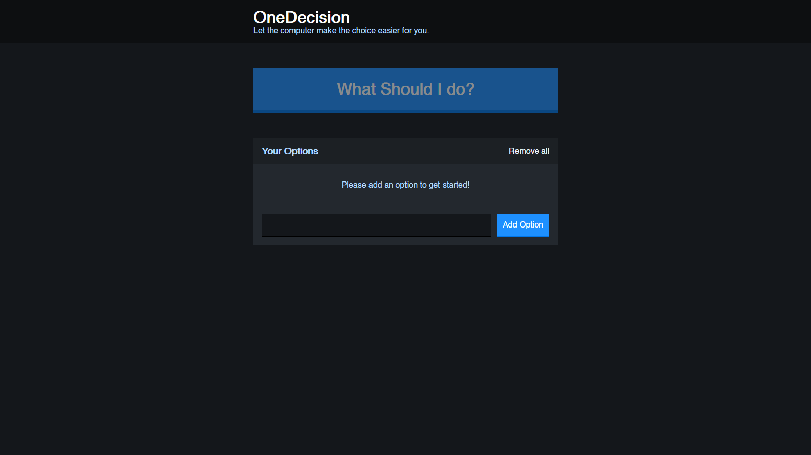

<!-- PROJECT LOGO -->
 

  
  
  <h3 align="center">OneDecision</h3>

  

    Are you stuck on a decision to make? Tell the computer your options and let it randomly select an option for you.
     
    <a href="#table-of-contents"><strong>Explore the docs ↓</strong></a>
     
     
    <a href="https://onedecision.herokuapp.com" target="_blank">View Demo</a>
    ·
    <a href="https://github.com/olayis/onedecision/issues">Report Bug</a>
    ·
    <a href="https://github.com/olayis/onedecision/issues">Request Feature</a>
  

<!-- TABLE OF CONTENTS -->

## Table of Contents

- [About the Project](#about-the-project)
  - [Built With](#built-with)
- [Getting Started](#getting-started)
  - [Prerequisites](#prerequisites)
  - [Installation](#installation)
- [Roadmap](#roadmap)
- [Contributing](#contributing)
- [License](#license)
- [Contact](#contact)

<!-- ABOUT THE PROJECT -->

## About The Project

### Built With

- Html
- SCSS
- React.js

<!-- GETTING STARTED -->

## Getting Started

To get a local copy up and running follow these simple steps.

### Prerequisites

- If you don't already have the following installed on your system, click on the links below to install:

  - Node.js - <https://nodejs.org/en/>
  - yarn - <https://classic.yarnpkg.com/en/docs/install/>

### Installation

1.Clone the onedecision repository

    git clone https://github.com/olayis/onedecision.git

2.Install all the dependencies of the project

    yarn

3.Run webpack development server

    yarn build:dev

    Runs the app in the development mode.

    Open http://localhost:3000 to view it in the browser.

    The page will reload if you make edits.

4.Run webpack production build

    yarn build:prod

    Builds the app for production.

5.Start up server to view app in production mode

    yarn start

    Open http://localhost:9000 to view the production mode in the browser.

## Roadmap

See the [open issues](https://github.com/olayis/onedecison/issues) for a list of proposed features (and known issues).

<!-- CONTRIBUTING -->

## Contributing

Contributions are what make the open source community such an amazing place to be learn, inspire, and create. Any contributions you make are **greatly appreciated**.

1. Fork the Project
2. Create your Feature Branch (`git checkout -b feature/AmazingFeature`)
3. Commit your Changes (`git commit -m 'Add some AmazingFeature'`)
4. Push to the Branch (`git push origin feature/AmazingFeature`)
5. Open a Pull Request

<!-- LICENSE -->

## License

Distributed under the MIT License. See `LICENSE` for more information.

<!-- CONTACT -->

## Contact

Olayinka Olusegun

- olayinkasegunsolo@gmail.com
- LinkedIn - <https://linkedin.com/in/olusegun-olayinka>
- Twitter - [@olusegun_os](https://twitter.com/olusegun_os)

Project Link: <https://onedecision.herokuapp.com>
